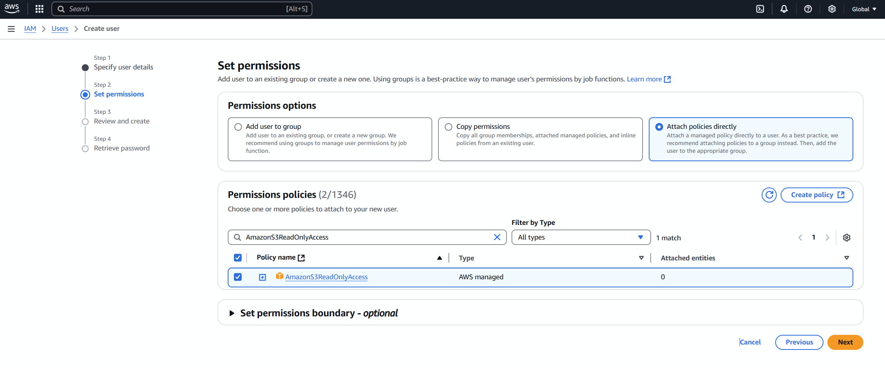
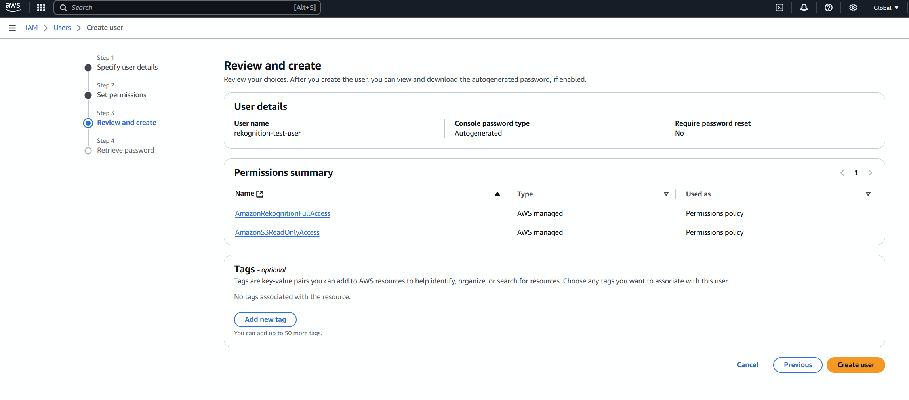
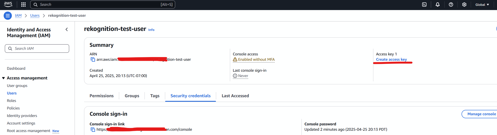
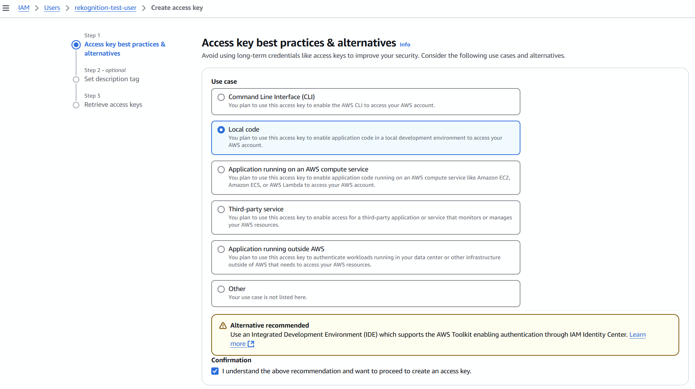
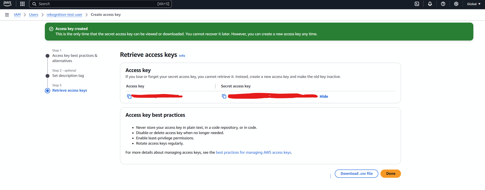
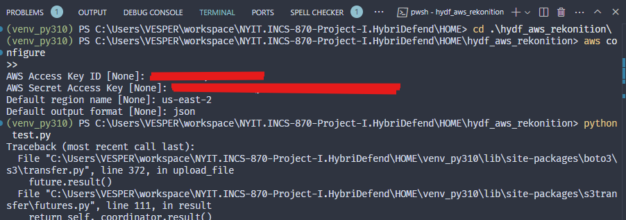
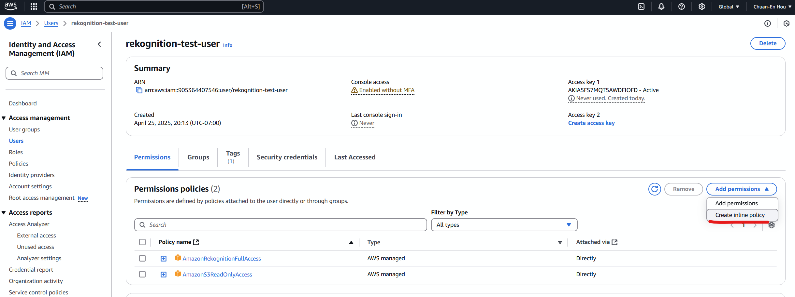
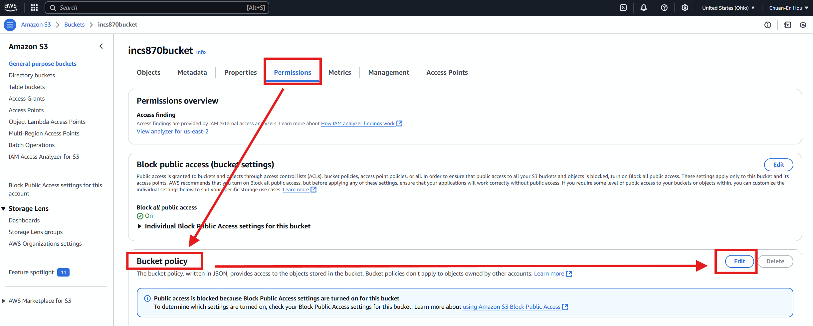
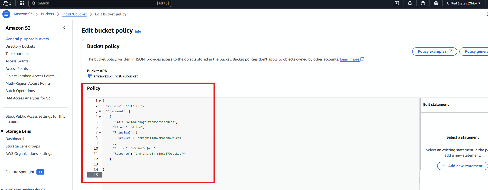

# Readme

1. Create bucket
     
2. Create IAM user
     
   Permission:  
   AmazonRekognitionFullAccess  
   AmazonS3ReadOnlyAccess
     
     
3. Create Access Key  
     
     
     
     

4. Configure AWS credentials locally  
   
   Installing or updating to the latest version of the AWS CLI  
   [download](https://docs.aws.amazon.com/cli/latest/userguide/getting-started-install.html)  
     

5. Let IAM user (rekonition-test-user) to be able to access the incs870bucket  
     
     

6. Upload the video by 'rekonition-test-user'
   ```python
   python upload_video.py
   ```
     
     

7. Setting bucket permission
     
     

8. change video format (Even though the file is .mp4, the inside codec (like audio/video compression format) might not be H.264 — AWS Rekognition only supports certain formats.)
	- Use ffmpeg to change format
	```python
	choco install ffmpeg
	ffmpeg -i deliver.mp4 -c:v libx264 -c:a aac -strict experimental deliver_fixed.mp4
	```

9. Ask AWS Rekonition to analyze my video
   ```python
   python analyze_video.py
   ```

   Response:  
    [8.0s] Surprised (51.0%)  
	[8.0s] Package Delivery (69.4%)  
	[8.0s] Person (86.4%)  
	[8.0s] Package Delivery (69.4%)  
	[8.0s] Package Delivery (69.4%)  
	[8.0s] Person (86.4%)  
	[8.0s] Surprised (51.0%)  
	[8.0s] Teen (59.8%)  
	[8.5s] Box (97.8%)  
	[8.5s] Boy (87.9%)  
	[8.5s] Cardboard (91.5%)  
	[8.5s] Carton (91.5%)  
	[8.5s] Face (75.0%)  
	[8.5s] Head (75.8%)  
	[8.5s] Male (91.3%)  
	[8.5s] Opening Present (55.4%)  
	[8.5s] Package (87.4%)  
	[8.5s] Package Delivery (83.5%)  
	[8.5s] Person (94.3%)  
	[8.5s] Teen (87.9%)  
	💾 Saved detailed result to labels_output.json


   
